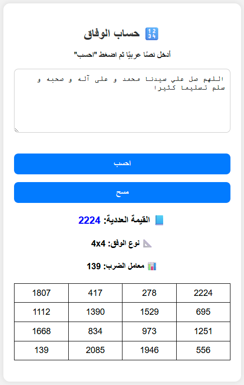

# 🧮 Wifaq – Arabic Abjad Value & Magic Square Generator

---

**Wifaq** is a simple Flask-based web app that calculates the **Abjad numerical value** of Arabic text and generates a compatible **magic square** (also known as *Wifaq*) that mathematically aligns with that value.

---

## 🚀 Features

- 🔤 Calculate the total numeric value of Arabic text using the **Abjad system**.
- 🧮 Automatically generate a magic square based on the value:
  - Odd magic squares
  - Doubly even magic squares (n % 4 == 0)
  - Singly even magic squares (n % 4 == 2)
- 📐 Auto-select square size and multiplier to match the total value.
- 🌐 Fully Arabic, mobile-friendly web interface with RTL layout.

---

## 📸 Screenshot



---

## 🛠️ Usage

### 1. Install requirements

```bash
pip install -r requirements.txt
```

### 2. Run the app

```bash
python run.py
```

Then open your browser at: [http://localhost:1010](http://localhost:1010)

---

## 🧠 How Abjad Value Works

The app uses the **Abjad numerals**, an old system assigning numeric values to Arabic letters. For example:

| Letter | Value |
|--------|-------|
| ا، أ، إ، آ | 1 |
| ب        | 2 |
| ج        | 3 |
| ...      | ... |
| غ        | 1000 |

The value of the input text is the sum of these letter values. A suitable magic square is then generated to match the total.

---

## 🧩 Project Structure

```
tameronline-wifaq/
├── README.md              ← This file
├── LICENSE                ← Apache 2.0 license
├── requirements.txt       ← Flask dependency
└── run.py                 ← Main Flask app
```

---

## 📄 License

This project is licensed under the [Apache 2.0 License](LICENSE).

---

## 👨‍💻 Author

- **Tamer Hamad Faour**  
- GitHub: [@TamerOnLine](https://github.com/TamerOnLine)  

---


