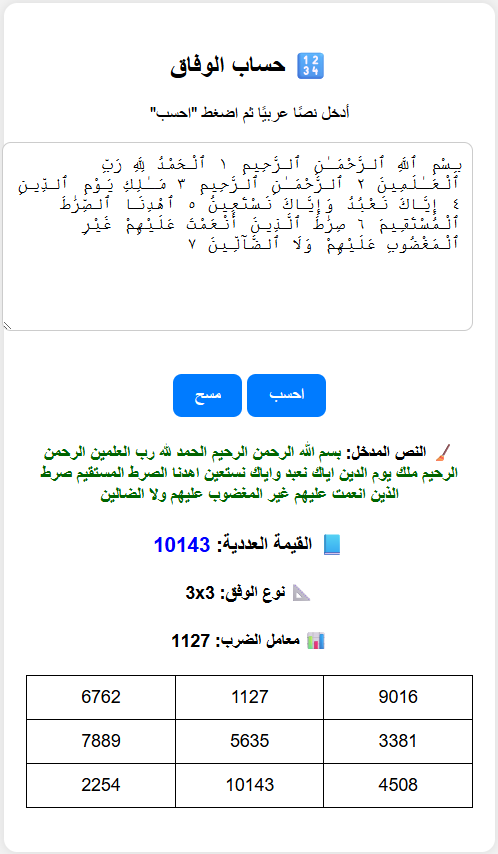

# 🥮 Wifaq – Arabic Abjad Value & Magic Square Generator

**Wifaq** is a lightweight, Flask-based web application designed to calculate the **Abjad numerical value** of Arabic text and generate a mathematically aligned **magic square** (*Wifaq*) based on that value.

---

## 📸 Screenshot



---

## 🎯 Features

* 🎤 Calculates Arabic text numeric values using the **Abjad system**.
* 🥮 Generates appropriate magic squares:

  * Odd, singly even, and doubly even square types.
* 📐 Auto-selects size and multiplier to match input total.
* 📱 RTL web UI in Arabic; responsive and mobile-friendly.

---

## 🛠️ Tech Stack

* Python 3
* Flask (Web Framework)
* HTML + CSS (for RTL layout and responsive design)

---

## 📦 Installation Instructions

1. **Clone the repository:**

   ```bash
   git clone https://github.com/TamerOnLine/tameronline-wifaq.git
   cd tameronline-wifaq
   ```

2. **Install dependencies:**

   ```bash
   pip install -r requirements.txt
   ```

3. **Run the application:**

   ```bash
   python run.py
   ```

4. **Open your browser:**

   Navigate to [http://localhost:1010](http://localhost:1010)

---

## 🚀 Usage Guide

1. Enter Arabic text into the input area.
2. Click **احسب** to compute the Abjad value and generate the corresponding Wifaq square.
3. View the results including:

   * Numeric value.
   * Magic square size and multiplier.
   * Rendered square in a table format.

---

## 📂 Project Structure

```
tameronline-wifaq/
├── README.md              ← Project documentation
├── LICENSE                ← Apache 2.0 License
├── requirements.txt       ← Python package requirements
├── run.py                 ← Main Flask application
└── im/
    └── Screenshot.png     ← App UI screenshot
```

---

## 📅 Downloads

### 🚀 Ready-to-Run Executable:
- 🪟 [Download for Windows – run.exe](https://github.com/TamerOnLine/wifaq/releases/latest/download/run.exe)

### 💾 Source Code:
- [Source code (ZIP)](https://github.com/TamerOnLine/wifaq/archive/refs/tags/v1.0.0.zip)
- [Source code (TAR.GZ)](https://github.com/TamerOnLine/wifaq/archive/refs/tags/v1.0.0.tar.gz)

---

## 🧾 License

Licensed under the [Apache 2.0 License](LICENSE).

---

## 👨‍💼 Author and Contact Info

* **Tamer Hamad Faour**
* GitHub: [@TamerOnLine](https://github.com/TamerOnLine)
